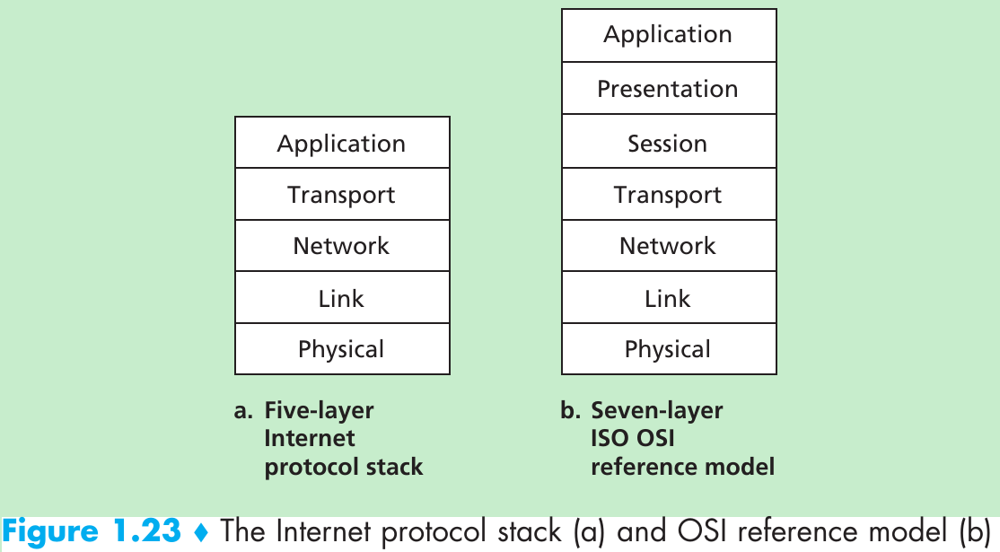
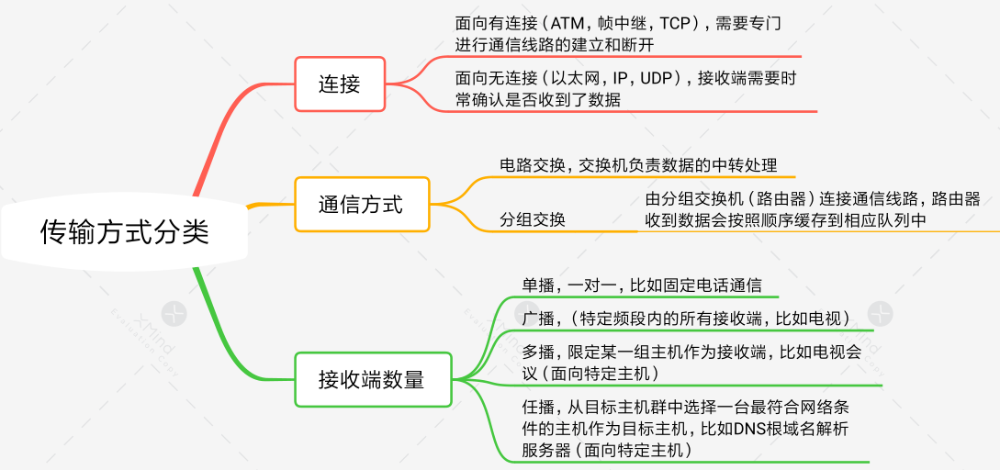
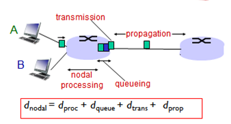
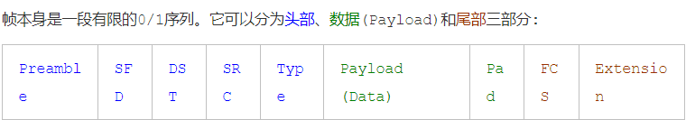
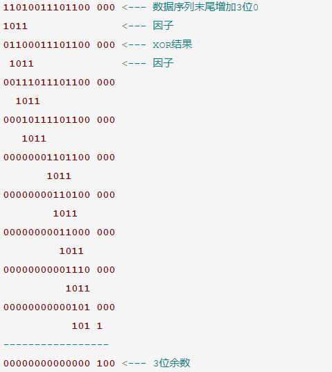
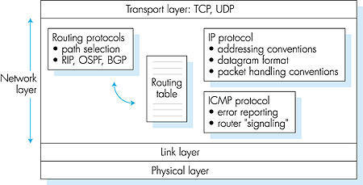
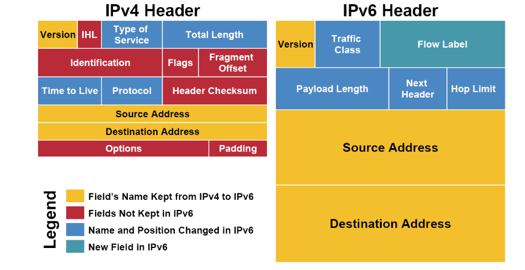
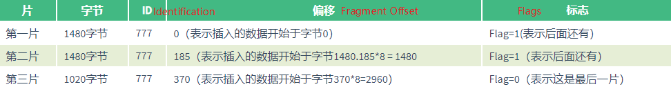
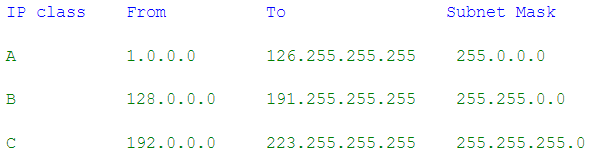

### 计算机网络概述

* 我在知乎看到了一段非常不错的总结，就直接丢过来用了,感谢回答者花潇！
我们的因特网，肯定是基于物理电路的，因此，我们需要一个将数据转化为物理信号的层，于是，物理层诞生啦！
有了处理物理信号的物理层，可我们还得知道，信号发给谁啊，你肯定知道，每个主机都有一个全球唯一的MAC地址吧，所以我们可以通过MAC地址来寻址啊，恭喜你，链路层诞生了！
别急，你知道MAC地址是扁平化的吧，也就是说，MAC地址的空间分布，是无规律的！！！如果你有十万台主机，要通过MAC地址来寻址，简直无F**K可说。不管怎样说，这么大的数据量，我们需要有个解决办法所以我们引入IP地址，网络层应运而生然而！
一台主机不能只和一台服务器通信啊，毕竟下小电影，也要同时货比三家啊。那如何实现并行通信呢？嘿嘿，我们有端口号啊，基于不同的需求，产生了UDP&TCP，运输层也诞生啦！
别急，你知道的吧，不同应用、不同的传输需求，比如请求网页、发邮件什么的，为了方便开发者，我们对这些常用需求进行了封装，这样就有了应用层的诞生！
这算是自底而上的讲述了计网，由此我们可以更好地理解每层layer的含义
#### 几个重要概念
* **Packet Switching分组交换技术**（packet switching）也称包交换，是将用户传送的数据划分成一定的长度，每个部分叫做一个分组，通过传输分组的方式传输信息的一种技术。**Circuit Switching电路交换方式**（circuit switching）是指在同一电信网用户群中任意两个或多个用户终端之间建立电路暂时连接的交换方式。

* **时延**及四种时延的关系 ：
结点时延=处理时延+排队时延（ 丢包问题，平均速率α，分组长度L，发送速率R, αL/R≤1）+发送时延（ 取决于分组长度与结点端口网卡的发送速率）+传播时延

    

* 数据通信系统5个组成部分：**报文 发送方 接受方 传输介质 协议**
* 数据传输单元相应是：**message->segment->datagram->frame->bit**
### 物理层
### 数据链路层
* 数据链路层设计的初衷就是顺利为网络层提供数据服务，不考虑可靠性，可靠性的部分由传输层的TCP协议实现为了使数据链路层能更好地适应多种局域网标准，802 委员会就将局域网的数据链路层拆成两个子层：逻辑链路控制 LLC (Logical Link Control)子层和介质访问控制 MAC (Medium Access Control)子层。
* 数据链路层使用的信道主要有以下两种类型：
    - 广播信道（多用于LAN）
    - 点对点信道，点对点信道的数据链路层的协议数据单元为帧(frame)，点对点信道的数据链路层在进行通信时的主要步骤：
        （1）结点A的数据链路层把网络层交下来的IP数据报添加首部和尾部封装成帧
        （2）结点A把封装好的帧发送给结点B的数据链路层。
        （3）若结点B的数据链路层收到的帧无差错，则从收到的帧中提取出IP数据报上交给上面的网络层；否则丢弃这个帧。
* 以太网是链路层的协议，我们先来看看以太网的帧。

* **头部**
> * 帧的最初7个byte被称为序言(preamble)。它的每个byte都是0xAA。通常，我们都会预定好以一定的频率发送0/1序列(比如每秒10bit)。如果接收设备以其他频率接收(比如每秒5bit)，那么就会错漏掉应该接收的0/1信息。但是，由于网卡的不同，发送方和接收方即使预订的频率相同，两者也可能由于物理原因发生偏差。序言是为了让接收设备调整接收频率，以便与发送设备的频率一致，这个过程就叫做时钟复原(recover the clock)。
>* 时钟调整好之后，我们等待帧的起始信号(SFD, start frame delimiter)。SFD是固定的值0xAB。
> * 紧随SFD之后的是6 byte的目的地(DST, destination)和6 byte的发出地(SRC, source)，也就是MAC地址，MAC地址是物理设备自带的序号。
> * 头部的最后一个区域是Type，用以说明数据部分的类型。(比如0x0800为IPv4，0x0806为ARP)

* **数据**
>* 数据一般包含有符合更高层协议的数据，比如IP包。链路层协议本身并不在乎数据是什么，它只负责传输。注意，数据尾部可能填充有一串0(PAD区域)。原因是数据需要超过一定的最小长度。
* **尾部**
>* 跟随在数据之后的是校验序列(FCS, Frame Check Sequence)。校验序列是为了检验数据的传输是否发生错误。在物理层，我们通过一些物理信号来表示0/1序列(比如高压/低压，高频率/低频率等)，但这些物理信号可能在传输过程中受到影响，以致于发生错误。数据链路层检测数据传输错误的方法一般是通过对差错编码进行校验来实现，常见的有奇偶校验码和循环冗余校验（CRC），FCS采用了CRC(Cyclic Redundancy Check)算法
> * n位CRC算法取一个n bit的因子，比如下面的1011。数据序列结尾增加n-1个0。因子与数据序列的不断进行XOR运算，直到得到n-1位的余数，也就是100。该余数各位取反(011)，然后存储在FCS的位置。

> * 在Ethernet中使用的因子为32位的，以达到更好的检测效果。
### 网络层
* 在网络层上，各个局域网根据IP协议相互连接，最终构成覆盖全球的Internet。

* 网络层有三个主要组件：
    - IP协议
    - 路由选择部分（计算和维护转发表）
    - ICMP（报告数据报中的差错和对默写网络层信息请求进行相应的设施）
#### IP协议
* 无论是TCP还是UDP，必须通过网络层的IP数据包(datagram)来传递信息。操作系统也会提供该层的socket，从而允许用户直接操作IP包，IP数据包是符合IP协议的信息。IP包分为头部(header)和数据(Data)两部分。数据部分是要传送的信息，头部是为了能够实现传输而附加的信息，与以太网帧的头部功能相类似。
* **ipv4 头部的前一部分是固定长度的共20字节，是所有IP分组必须具有的**，在头部固定部分的后面是一些可选字段，其长度是可变的，用来提供错误检测及安全等机制。IPv4的地址为4 bytes的长度(也就是32位)。我们通常将IPv4的地址分为四个十进制的数，每个数的范围为0-255,比如192.0.0.1就是一个IP地址。填写在IP包头部的是该地址的二进制形式。

*  **协议详解**
    * 黄色区域 (同名区域)
         - 三个黄色区域跨越了IPv4和IPv6。Version(4位)用来表明IP协议版本，是IPv4还是IPv6(IPv4, Version=0100; IPv6, Version=0110)。Source Adrresss和Destination Address分别为发出地和目的地的IP地址。
    * 蓝色区域 （名字发生变动的区域）
        - Time to Live 存活时间(Hop Limit in IPv6)。记录一个整数(比如30)，表示在IP包接力过程中最多经过30个路由接力，如果超过30个路由接力，那么这个IP包就作废。IP包每经过一个路由器，路由器就给Time to Live减一。当一个路由器发现Time to Live为0时，就不再发送该IP包。IPv6中的Hop Limit区域记录的也是最大路由接力数，与IPv4的功能相同。Time to Live/Hop Limit避免了IP包在互联网中无限接力。
        - Type of Service 服务类型(Traffic Class in IPv6)。Type of Service被实际分为两部分：Differentiated Service Field (DS, 前6位)和Explicit Congestion Notification (ECN, 后2位)，前者依然用来区分服务类型，而后者用于表明IP包途径路由的交通状况。IPv6的Traffic Class也被如此分成两部分。通过IP包提供不同服务的想法，并针对服务进行不同的优化，比如ECN区域，它用来表示IP包经过路径的交通状况。如果接收者收到的ECN区域显示路径上的很拥挤，那么接收者应该作出调整。但在实际上，许多接收者都会忽视ECN所包含的信息。交通状况的控制往往由更高层的比如TCP协议实现。
        - Protocol 协议(Next Header in IPv6)。Protocol用来说明IP包Payload部分所遵循的协议，也就是IP包之上的协议是什么。它说明了IP包封装的是一个怎样的高层协议包(TCP? UDP?)。
        - IPv4中整个IP包 Total Length=IHL+数据部分；IPv6中整个IP包 40 bytes + Payload Length。
     * 红色区域 (IPv6中删除的区域)
        - 不考虑options的话，整个IPv4头部有20 bytes(上面每行为4 bytes)。但由于有options的存在，整个头部的总长度是变动的。我们用**IHL(Internet Header Length**)来记录头部的总长度，用**Total Length**记录整个IP包的长度。**IPv6没有options**，它的头部是固定的长度40 bytes，所以**IPv6中并不需要IHL区域**。Payload Length用来表示IPv6的数据部分的长度。整个IP包为40 bytes + Payload Length。
        - IPv4中还有一个**Header Checksum**区域。这个checksum用于校验IP包的头部信息。IPv6则没有checksum区域。IPv6包的校验依赖高层的协议来完成，这样的好处是免去了执行checksum校验所需要的时间，减小了网络延迟 (latency)。
        - **Identification, flags和fragment offset，这三个包都是为分片(fragmentation)服务的。分片会给路由器和网络带来很大的负担。最好在IP包发出之前探测整个路径上的最小MTU，IP包的大小不超过该最小MTU，就可以避免分片。IPv6在设计上避免分片。每一个IPv6局域网的MTU都必须大于等于1280 bytes。IPv6的默认发送IP包大小为1280 bytes。**
     * IPv6新增区域：Flow Label是IPv6中新增的区域。它被用来提醒路由器来重复使用之前的接力路径。这样IP包可以自动保持出发时的顺序。这对于流媒体之类的应用有帮助。Flow label的进一步使用还在开发中。
* **IP数据包分片(fragmentation)**，一个链路层数据报能承载的最大数据量称为**最大传送单元（MTU**）。因为IP数据报被封装在链路层数据报中，故链路层的MTU严格地限制着IP数据报的长度，而且在IP数据报的源于目的地路径上的各段链路可能使用不同的链路层协议，有不同的MTU。当IP数据报的总长度大于链路MTU，就需要将IP数据报中的数据分装在两个或更多个较小的IP数据报中，这些较小的数据报叫做片。**注意**：为坚持网络内核保持简单的原则，IPv4的设计者决定数据报的重新组装工作放到端系统中，而不是在网络路由器中。分片举例：

* **IP子网划分**，连接在Internet中的每一台主机（或路由器）都分配一个32比特的全球唯一的标识符，即IP地址。传统的IP地址是分类的地址，分为A、B、C、D、E五类(A：1-126 B：128-191 C：192-223 D：224-239 E：240-255)，每个IP地址的32位分为前后两部分，第一部分用来区分局域网，第二个部分用来区分该局域网的主机。
    - **子网掩码**(Subnet Mask)告诉我们这两部分的分界线，比如255.0.0.0(也就是8个1和24个0)表示前8位用于区分局域网，后24位用于区分主机。由于A、B、C分类是已经规定好的，所以当一个IP地址属于B类范围时，我们就知道它的前16位和后16位分别表示局域网和主机。

    - **网络地址转换（NAT**）是通过将专用网络地址转换为公用地址，从而对外隐藏了内部管理的IP地址。它使得整个专用网只需要一个全球IP地址就可以与因特网连通，由于专用网本地IP地址是可重用的，所以NAT大大节省了IP地址的消耗。同时，它隐藏了内部网络结构，从而降低了内部网络收到攻击的风险。
* **DHCP(the Dynamic Host Configuration Protocol)**,动态主机配置协议)它可以为客户机自动分配IP地址、子网掩码以及缺省网关、DNS服务器的IP地址等TCP/IP参数，简单来说，就是在DHCP服务器上有一个数据库，存放着IP地址、网关、DNS等参数。当客户端请求使用时，服务器则负责将相应的参数分配给客户端。以避免客户端手动指定IP地址。**DHCP是基于UDP的应用层协议**，来看下DHCP的工作过程：
>1. DHCP DISCOVER: 寻找服务器　　当DHCP客户端第一次登录网络的时候或者是开机时，此计算机发现本机上没有任何IP地址设定，就会向网络广播去寻找DHCP服务器。该数据包的来源地址会为0.0.0.0，而目的地址则为255.255.255.255。　　
>2. DHCP OFFER 分配IP地址　　当无线设备监听到客户端发出的寻找服务器的数据包后，它会从那些还没有分配出的IP地址里，选择最前面的的空闲IP，给客户端一个分配IP地址，但这里仅仅是分配，客户端还没有真正应用上。　　
>3. DHCP REQUEST 请求使用　　客户端收到无线设备发送回来的分配IP地址数据包，客户端会向网络发送一个**ARP数据包**，确认网络中没有其他机器使用该IP地址，如果已经有，则重复发送步骤1中的动作;如果没有，则接受该IP地址，并发送一个DHCP request数据包给无线路由器，也就是DHCP服务器，请求使用此地址。　　
>4. DHCP ACK IP地址分配确认　　当无线设备接收到客户端的DHCP request数据包之后，会向客户端发出一个DHCP ACK回应，以确认IP地址的正式生效，也就结束了一个完整的DHCP工作过程。
#### **ARP协议** 
 *  IP地址与MAC地址的对应是通过ARP协议传播到局域网的每个主机和路由。每一台主机或路由中都有一个ARP cache，用以存储局域网内IP地址和MAC地址如何对应。
 * ARP协议(ARP介于链路层和网络层之间，ARP包需要包裹在一个帧中)的工作方式如下：主机会发出一个ARP包，该ARP包中包含有自己的IP地址和MAC地址。通过ARP包，主机以广播的形式询问局域网上所有的主机和路由：我是IP地址xxxx，我的MAC地址是xxxx，有人知道199.165.146.4的MAC地址吗？拥有该IP地址的主机会回复发出请求的主机：哦，我知道，这个IP地址属于我的一个NIC，它的MAC地址是xxxxxx。由于发送ARP请求的主机采取的是广播形式，并附带有自己的IP地址和MAC地址，其他的主机和路由会同时检查自己的ARP cache，如果不符合，则更新自己的ARP cache。这样，经过几次ARP请求之后，ARP cache会达到稳定。如果局域网上设备发生变动，ARP重复上面过程。
#### [ICMP协议](http://www.cnblogs.com/vamei/archive/2012/12/05/2801991.html)
* **ICMP(Internet Control Message Protocol)** 是介于网络层和传输层的协议。它的主要功能是传输网络诊断信息，ICMP基于IP协议。也就是说，一个ICMP包需要封装在IP包中，然后在互联网传送。ICMP是IP套装的必须部分，也就是说，任何一个支持IP协议的计算机，都要同时实现ICMP。
* 一类是错误(error)信息，这一类信息可用来诊断网络故障。如果IP包没有被传送到目的地，或者IP包发生错误，IP协议本身不会做进一步的努力。但上游发送IP包的主机和接力的路由器并不知道下游发生了错误和故障，它们可能继续发送IP包。通过ICMP包，下游的路由器和主机可以将错误信息汇报给上游，从而让上游的路由器和主机进行调整。需要注意的是，ICMP只提供特定类型的错误汇报，它不能帮助IP协议成为“可靠”(reliable)的协议。
* 另一类信息是咨询(Informational)性质的，比如某台计算机询问路径上的每个路由器都是谁，然后各个路由器同样用ICMP包回答。

* ICMP包都会有Type, Code和Checksum三部分。Type表示ICMP包的大的类型，而Code是一个Type之内细分的小类型。针对不同的错误信息或者咨询信息，会有不同的Type和Code。
Checksum与IP协议的header checksum相类似，但与IP协议中checksum只校验头部不同，这里的Checksum所校验的是整个ICMP包(包括头部和数据)。
* ICMP协议是实现ping命令和traceroute命令的基础。这两个工具常用于网络排错。

#### 路由选择部分
* 网卡是计算机的一个硬件，它在接收到网路信息之后，将信息交给计算机(处理器/内存)，路由器(router)实际上就是一台配备有多个网卡的专用电脑，它让网卡接入到不同的网络中。路由器的内部结构和工作原理，它有四种组件构成:
    - Input ports [输入端口]
    - Output ports [输出端口]
    - Switching fabric [交换结构]
    - Routing processor [路由选择处理器]
 * **IP包的传输要通过路由器的路由**。每一个主机和路由器中都存有一个**路由表(routing table)**。路由表根据目的地的IP地址，**规定了等待发送的IP包所应该走的路线（不得不提路由算法，）**。中间的router在收到IP包之后(实际上是收到以太协议的帧，然后从帧中的payload读取IP包)，提取目的地IP地址，然后对照自己的routing table，送到下一个目的ip地址。整个过程中，IP包不断被主机和路由封装入帧并拆开，然后借助链路层，在局域网的各个NIC之间传送帧。整个过程中，我们的IP包的内容保持完整，没有发生变化。最终的效果是一个IP包从一个主机传送到另一个主机。利用IP包，我们不需要去操心底层发生了什么。
 * **路由算法**，即已知一组路由器及连接路由器链路的情况下,找出一条由源节点到目标节点的最佳路径。
 
几种主要的路由算法:　　　　
* 静态路由算法(非自适应路由算法):　　　　　　
  - 1.最短路径路由算法(Shortest Path Routing).　　　　　
  - 2.扩散算法　　　　
* 动态路由算法(自适应路由算法):　　　　　　
  - 1.距离矢量路由算法(Distance-Vector)　　　　　　
  - 2.链路状态路由算法(Link-State)
 * **因特网的路由协议**
    - **RIP(Routing Information Protocol)路由信息协议** 是内部网关协议中最先得到广泛应用的协议，是一种分布式的基于距离向量的路由选择协议，其最大优点就是简单。缺点是RIP限制了网络的规模，它能使用的最大距离为15（16为不可达），除此之外开销很大。
    - **OSPF (Open Shortest Path First)**，开放最短路径优先协议是使用分布式链路状态路由算法的典型代表。OSPF收敛速度快，适应各种规模，将协议自身的开销控制到最小，同时也具有良好的安全性。**OSPF是网络层协议，它不使用UDP或TCP而是直接IP数据报传送。**
    - **BGP (Border Gateway Protocol)**: 边界网关协议是不同自治系统的路由器之间交换路由信息的协议。边界网关协议常常应用于互联网的网关之间。路由表包含已知路由器的列表、路由器能够达到的地址以及到达每个路由器的路径的跳数。**边界网关协议BGP只能是力求寻找一条能够到达目的网络且比较好的路由，而并非要寻找一条最佳路由**。BGP采用的是路径向量路由选择协议，它与距离向量协议和链路状态协议有很大区别。BGP协议是应用层协议，基于TCP的。
#### ICMP
* **ICMP(Internet Control Message Protocol)** 是介于网络层和传输层的协议。它的主要功能是传输网络诊断信息。

### 传输层
* 网络上主机与主机之间的通信，实质上是主机上运行的应用进程之间的通信。例如，当你通过Http上网浏览网页时，实质上是你所访问的主机的服务器进程与你本机的浏览器进程在进行通信。试想一下，当你在上网的同时，还挂着QQ，还使用ftp下载大文件，这时就有三个网络上的进程与你的主机上的三个进程进行通信，那么系统是怎么样正确地把接收到的数据定位到指定的进程中的呢？也就是说，系统是怎么把从ftp服务器发送过来的数据交付到ftp客户端，而不把这些数据交付到你的QQ上的呢？反过来考虑，系统又是如何精确地把来自各个应用进程的数据发到网络上指定上的主机（服务器）上的对应进程的呢？这就是多路分解与多路复用的作用了。每个运输层的报文段中设置了几个字段，包括源端口号和目的端口号等。多路分解就是，在接收端，运输层检查这些字段并标识出接收套接字，然后将该报文定向到该套接字。多路复用就是从源主机的不同套接字中收集数据块，并为每个数据块封装上首部信息从而生成报文段，然后将报文段传递到网络层中去。
* **UDP** 的数据包同样分为头部(header)和数据(payload)两部分。UDP是传输层(transport layer)协议，这意味着UDP的数据包需要经过IP协议的封装(encapsulation)，然后通过IP协议传输到目的电脑。随后UDP包在目的电脑拆封，并将信息送到相应端口的缓存中。

* source port和destination port分别为UDP包的出发端口和目的地端口。Length为整个UDP包的长度，UDP的checksum所校验的序列包括了整个UDP数据包，以及封装的IP头部的一些信息(主要为出发地IP和目的地IP)。这样，checksum就可以校验**IP：端口**的正确性了。在IPv4中，checksum可以为0，意味着不使用checksum。IPv6要求必须进行checksum校验。